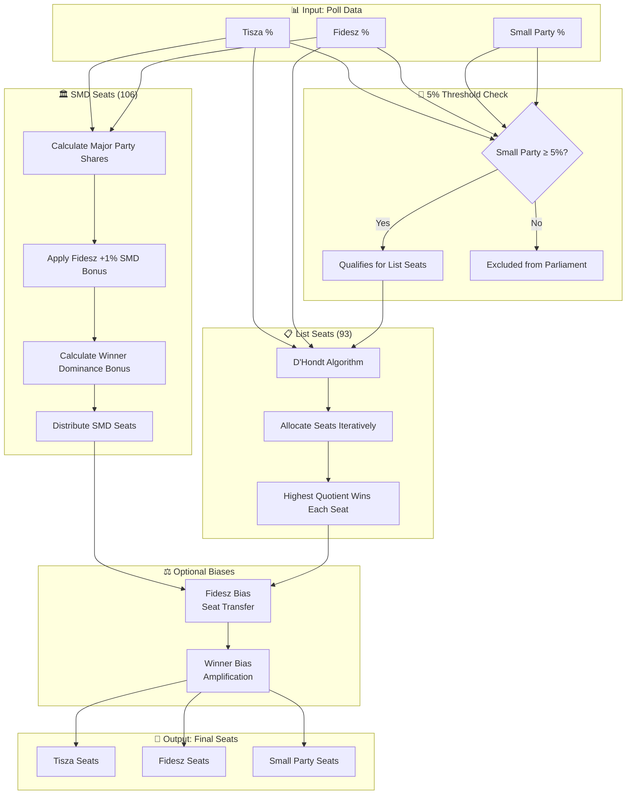
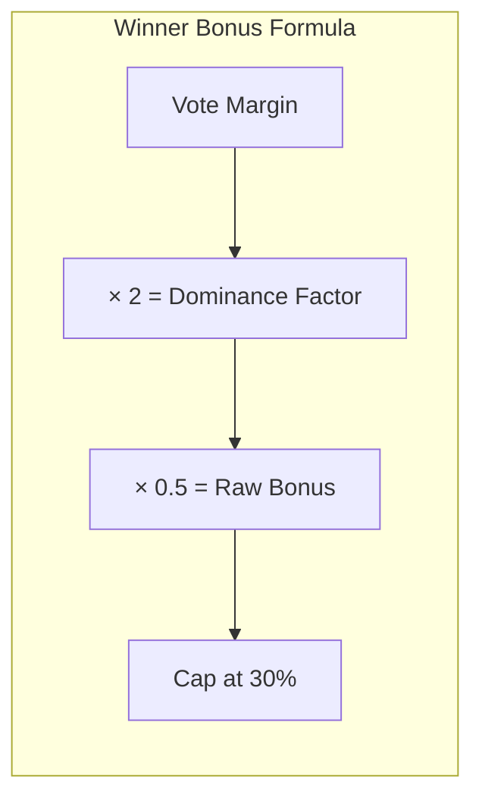
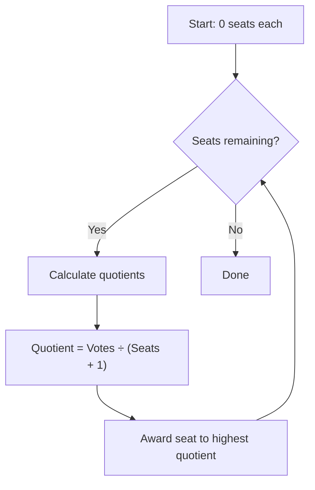
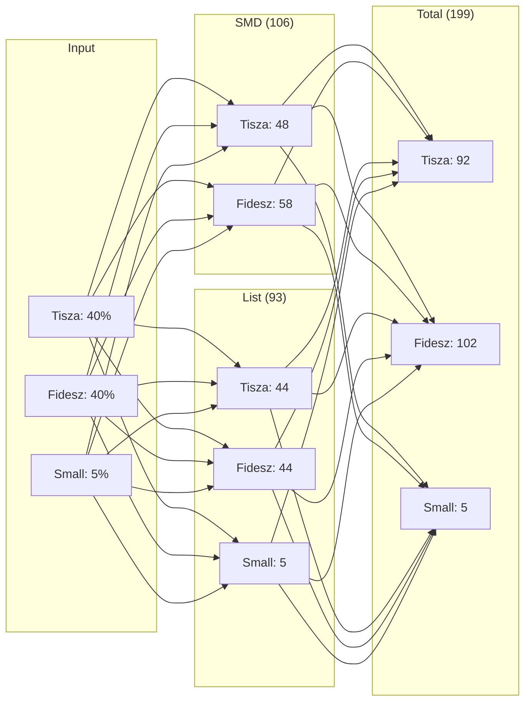

# Calculation Methodology

This document explains how the Hungary Election Bias Simulator converts poll numbers into parliamentary seats, including the mathematical models and code references.

## System Overview

Hungary has **199 parliamentary seats** distributed through a mixed electoral system:
- **106 Single-Member District (SMD) seats** - Winner-take-all
- **93 National List seats** - Proportional (D'Hondt)

## Calculation Flow



## Detailed Algorithm Steps

### Step 1: Parliamentary Threshold (5%)

Parties must achieve at least 5% of the vote to enter parliament.

```typescript
// lib/seat-calculation.ts:121-122
const smallPartyPassesThreshold = votes.smallParty >= PARLIAMENTARY_THRESHOLD
const qualifyingSmallParty = smallPartyPassesThreshold ? votes.smallParty : 0
```

### Step 2: SMD Seat Calculation

SMD seats use winner-take-all with structural advantages:

#### 2a. Fidesz SMD Bonus (~1%)

Fidesz historically overperforms in SMD vs their national list vote share by approximately 1%.

```typescript
// lib/seat-calculation.ts:85-87
const adjustedFideszSmdShare = Math.min(1, fideszShare + fideszSmdBonus)
const adjustedTiszaSmdShare = 1 - adjustedFideszSmdShare
```

#### 2b. Winner Dominance Bonus

The leading party receives a non-linear bonus in SMD seats (up to 30% of seats).



```typescript
// lib/seat-calculation.ts:90-92
const smdDominanceFactor = Math.abs(adjustedFideszSmdShare - adjustedTiszaSmdShare) * 2
const smdWinnerBonus = Math.min(0.3, smdDominanceFactor * 0.5)
```

#### 2c. SMD Distribution

```typescript
// lib/seat-calculation.ts:94-101
if (adjustedTiszaSmdShare > adjustedFideszSmdShare) {
  smdTisza = Math.round(SMD_SEATS * (adjustedTiszaSmdShare + smdWinnerBonus))
  smdFidesz = SMD_SEATS - smdTisza
} else {
  smdFidesz = Math.round(SMD_SEATS * (adjustedFideszSmdShare + smdWinnerBonus))
  smdTisza = SMD_SEATS - smdFidesz
}
```

### Step 3: D'Hondt Proportional Allocation (List Seats)

The 93 list seats are distributed using the D'Hondt method:



```typescript
// lib/seat-calculation.ts:39-61
export function dHondtAllocate(
  votes: VoteShare,
  seats: number,
  includeSmallParty: boolean
): PartySeats {
  const result: PartySeats = { tisza: 0, fidesz: 0, smallParty: 0 }

  for (let i = 0; i < seats; i++) {
    const quotients: { party: keyof PartySeats; value: number }[] = [
      { party: 'tisza', value: votes.tisza / (result.tisza + 1) },
      { party: 'fidesz', value: votes.fidesz / (result.fidesz + 1) },
    ]
    if (includeSmallParty && votes.smallParty > 0) {
      quotients.push({ party: 'smallParty', value: votes.smallParty / (result.smallParty + 1) })
    }

    // Find party with highest quotient and give them the seat
    const winner = quotients.reduce((max, curr) => curr.value > max.value ? curr : max)
    result[winner.party]++
  }

  return result
}
```

### Step 4: Combine SMD + List Seats

```typescript
// lib/seat-calculation.ts:139-143
return {
  tisza: smdSeats.tisza + listSeats.tisza,
  fidesz: smdSeats.fidesz + listSeats.fidesz,
  smallParty: listSeats.smallParty, // Small parties only get list seats
}
```

### Step 5: Apply Optional Biases

#### 5a. Fidesz Bias (Seat Transfer)

Transfers seats from Tisza to Fidesz based on various advantages.

```typescript
// lib/seat-calculation.ts:166-168
const actualFideszBias = Math.min(fideszBias, tisza)
fidesz += actualFideszBias
tisza -= actualFideszBias
```

#### 5b. Winner Bias (Amplification)

Further amplifies the leading party's advantage.

```typescript
// lib/seat-calculation.ts:171-179
if (winner === 'tisza') {
  const actualWinnerBias = Math.min(winnerBias, fidesz)
  tisza += actualWinnerBias
  fidesz -= actualWinnerBias
} else {
  const actualWinnerBias = Math.min(winnerBias, tisza)
  fidesz += actualWinnerBias
  tisza -= actualWinnerBias
}
```

## Example Calculations

### Example 1: Equal Polls (40% / 40% / 5%)



Even with equal polls, Fidesz leads due to the 1% SMD structural advantage.

### Example 2: Tisza Lead (48% / 41% / 5%)

With Tisza leading by 7 points:
- Tisza wins SMD majority + winner bonus
- Result: Tisza ~111 seats, Fidesz ~83 seats

### Example 3: Small Party Below Threshold (40% / 40% / 4%)

- Small party excluded (below 5%)
- Their votes don't transfer
- Only Tisza and Fidesz split all 199 seats

## Constants

| Constant | Value | Description |
|----------|-------|-------------|
| `TOTAL_SEATS` | 199 | Total parliamentary seats |
| `SMD_SEATS` | 106 | Single-member district seats |
| `LIST_SEATS` | 93 | National list seats |
| `PARLIAMENTARY_THRESHOLD` | 5% | Minimum vote share for parliament |
| `FIDESZ_SMD_BONUS` | 1% | Fidesz structural advantage in SMD |
| `MAX_WINNER_BONUS` | 30% | Maximum winner dominance bonus |

## Bias Categories

### Opinion-Forming Biases (Pre-vote)
- State media dominance
- Campaign financing advantages
- Influence measured in **percentage points**

### Vote-Gathering Biases (Voting process)
- Foreign (mail-in) voting
- Embassy voting for citizens abroad
- Influence measured in **percentage points**

### Seat-Conversion Biases (Post-vote)
- Gerrymandering effects
- Winner-take-all amplification
- Influence measured in **seats**

## References

- [Hungarian Electoral Law](https://njt.hu/jogszabaly/2011-203-00-00)
- [taktikaiszavazas.hu Methodology](https://taktikaiszavazas.hu/modszertan)
- [D'Hondt Method (Wikipedia)](https://en.wikipedia.org/wiki/D%27Hondt_method)

## Code Files

| File | Description |
|------|-------------|
| [`lib/seat-calculation.ts`](./lib/seat-calculation.ts) | Core calculation algorithms |
| [`lib/seat-calculation.test.ts`](./lib/seat-calculation.test.ts) | 47 unit tests |
| [`components/parliament-visualization.tsx`](./components/parliament-visualization.tsx) | Main UI component |
